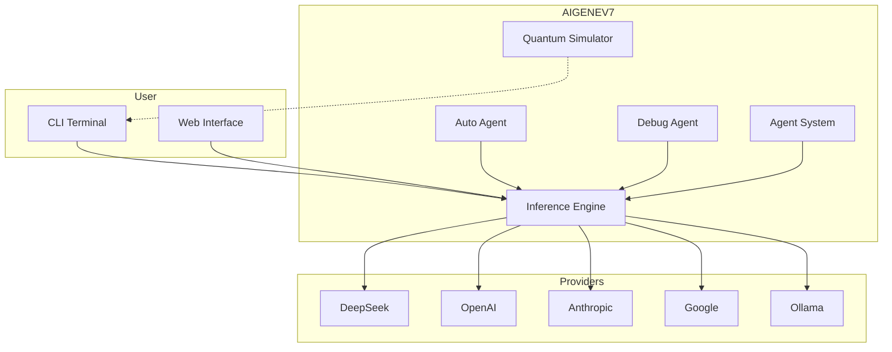
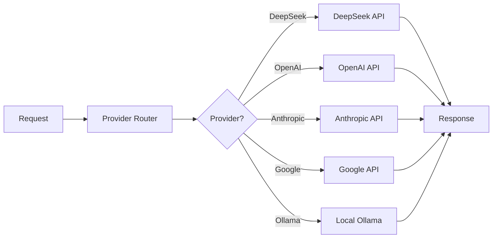
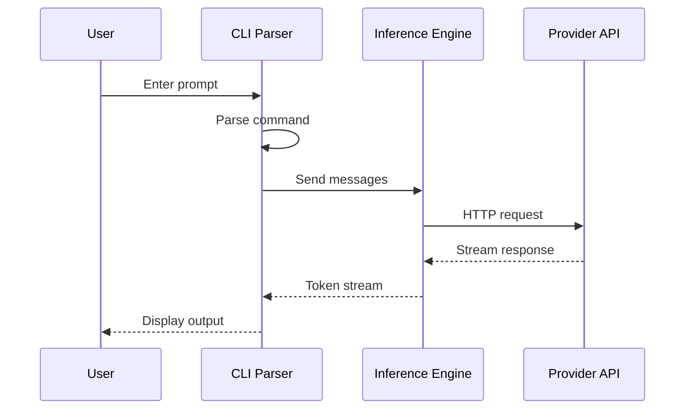
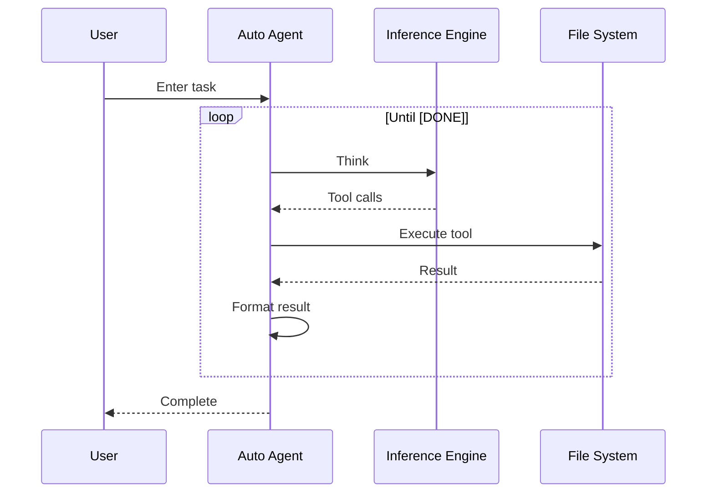

# Architecture

## Project Structure

```
AIGENEV7/
├── freebuff/                 # Main AIGENEV7 directory
│   ├── inference.js          # Multi-model inference engine
│   ├── inference.json        # Model configuration & defaults
│   ├── inference-cli.js      # CLI entry point (interactive mode)
│   ├── models.js             # Model catalog (15+ models)
│   ├── auto-agent.js         # Autonomous coding agent (17 tools)
│   ├── custom-agents.js      # Custom agent system (30 agents)
│   ├── defensive-offensive.js # Blue Team/Red Team framework
│   ├── quantum.js            # Quantum circuit simulator (28 qubits)
│   ├── premium.js            # Premium features & payment
│   ├── debug-agent.js        # Debug agent
│   ├── snippets.js           # Code snippets system
│   ├── token-balance.json    # Token usage tracking
│   ├── content-filter.conf   # Content filter settings
│   ├── bunconfig.js          # Runtime configuration
│   ├── start.bat             # Windows launcher
│   ├── .env.example          # Environment template
│   │
│   ├── web/                  # Web interface
│   │   ├── index.html        # Landing page
│   │   ├── architecture.html # Architecture page
│   │   ├── css/style.css     # Styles
│   │   ├── js/chat.js        # Chat interface
│   │   ├── js/data.js        # Agent data
│   │   └── js/auto-agent-web.js # Auto agent web client
│   │
│   └── wiki/                 # GitHub Wiki content
│       ├── Home.md
│       ├── Getting-Started.md
│       ├── Models.md
│       └── ...
│
├── cli/                      # TUI client (OpenTUI + React)
│   ├── src/
│   │   ├── app.tsx
│   │   ├── chat.tsx
│   │   └── cli-args.ts
│   └── package.json
│
├── sdk/                      # JS/TS SDK
│   ├── src/
│   │   ├── client.ts
│   │   ├── run.ts
│   │   └── index.ts
│   └── package.json
│
├── common/                   # Shared types & utilities
│   ├── src/
│   │   ├── actions.ts
│   │   ├── analytics.ts
│   │   └── env.ts
│   └── package.json
│
├── agents/                   # Public agent definitions
│   ├── base-chat.ts
│   └── basher.ts
│
├── packages/                 # Internal packages
│   ├── agent-runtime/        # Agent runtime
│   ├── code-map/             # Source parsing
│   └── llm-providers/        # LLM provider shims
│
├── docs/                     # Documentation site
│   ├── index.md
│   └── ...
│
└── scripts/                  # Build & release scripts
    └── tmux/                 # CLI testing helpers
```

## System Architecture Diagram



## Core Components

### 1. Inference Engine (`inference.js`)

The heart of AIGENEV7 — handles all LLM API calls.



**Key Features:**
- Multi-provider support (10+ providers)
- Streaming responses
- Token counting
- Rate limit handling
- Retry logic

### 2. Auto Agent (`auto-agent.js`)

Autonomous coding agent with 17 tools.

```
┌─────────────────────────────────────────┐
│           Auto Agent Loop                │
├─────────────────────────────────────────┤
│  1. Think (AI decides)                  │
│  2. Act (Execute tool)                  │
│  3. Observe (Process result)            │
│  4. Repeat until [DONE]                 │
├─────────────────────────────────────────┤
│  Tools: READ, WRITE, EDIT, DELETE,      │
│  RENAME, COPY, LIST, GLOB, GREP,        │
│  RUN, FETCH, DIFF, REPLACEALL,          │
│  APPEND, INSERT, STATUS, DONE           │
└─────────────────────────────────────────┘
```

### 3. Agent System (`custom-agents.js`)

Manages 30+ specialized AI personas.

```
┌─────────────────────────────────────────┐
│           Agent System                   │
├─────────────────────────────────────────┤
│  Core Agents (12)                       │
│  ├── default, debugger, tech-writer     │
│  ├── sql-expert, architect, pythonista  │
│  ├── react-dev, mentor, socratic        │
│  └── quantum-dev, banking, web3         │
│                                         │
│  Framework Agents (18)                  │
│  ├── Defensive (9) - Blue Team          │
│  └── Offensive (9) - Red Team           │
└─────────────────────────────────────────┘
```

### 4. Defensive/Offensive Framework (`defensive-offensive.js`)

Structured framework of specialized agent personas.

```
┌─────────────────────────────────────────┐
│     Defensive/Offensive Framework        │
├──────────────────┬──────────────────────┤
│   🛡️ Defensive   │   ⚔️ Offensive       │
│   (Blue Team)    │   (Red Team)         │
├──────────────────┼──────────────────────┤
│ Security Auditor │ Zero-Day Engineer    │
│ Code Reviewer    │ Code Optimizer       │
│ Test Engineer    │ Refactor Agent       │
│ Compliance       │ Feature Implementer  │
│ Error Prevention │ API Generator        │
│ Type Guardian    │ Code Translator      │
│ Input Validator  │ Test Generator       │
│ Dependency Audit │ Database Migrator    │
│ Lint Enforcer    │ CI/CD Builder        │
└──────────────────┴──────────────────────┘
```

## Data Flow

### User Request Flow



### Auto Agent Flow



## Technology Stack

| Layer | Technology |
|-------|------------|
| Runtime | Bun |
| Language | TypeScript/JavaScript |
| CLI Framework | OpenTUI + React |
| Package Manager | Bun |
| Testing | Bun Test |
| Linting | ESLint |
| Formatting | Prettier |
| CI/CD | GitHub Actions |
| Documentation | Markdown + GitHub Pages |

## Key Design Principles

1. **Zero Configuration** — Works out of the box with minimal setup
2. **Unlimited** — No token limits, rate limits, or session caps
3. **Uncensored** — No content filters or safety classifiers
4. **Multi-Model** — Support for 15+ AI models
5. **Extensible** — Custom agents, framework agents, and tools
6. **Local-First** — Ollama support for fully local inference

---

*See [Getting Started](Getting-Started) for setup instructions and [Commands](Commands) for CLI reference.*
