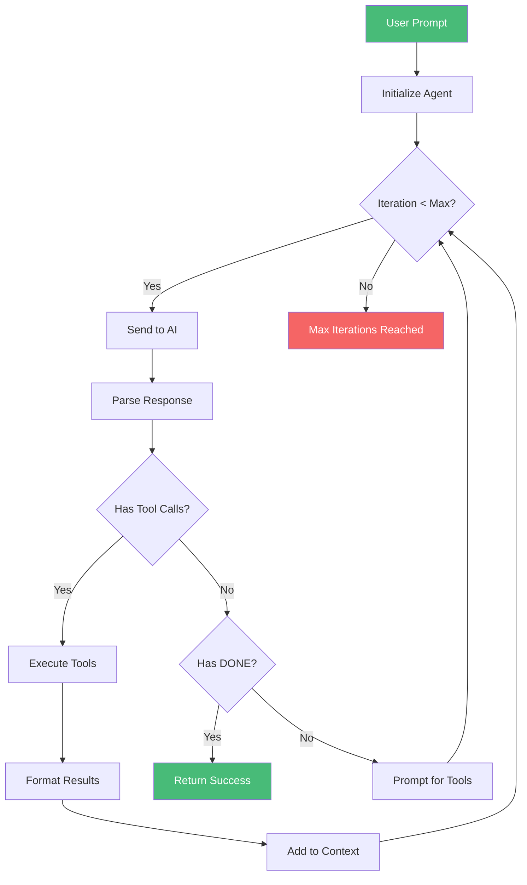

# Auto Agent

The Auto Agent is an autonomous coding agent with **17 tools** that can read, write, edit, search, rename, copy, fetch, and manipulate files without human intervention.

## Overview



The Auto Agent works in a loop:
1. **Think** — AI decides what to do next
2. **Act** — Executes one tool (read file, write code, run command, etc.)
3. **Observe** — Processes the tool result
4. **Repeat** — Continues until the task is complete

## Available Tools

### File Operations

| Tool | Syntax | Description |
|------|--------|-------------|
| **READ** | `[READ: path]` | Read a file's contents |
| **WRITE** | `[WRITE: path]\ncontent` | Write/overwrite a file |
| **EDIT** | `[EDIT: path]\nOLD: ...\nNEW: ...` | Find and replace text |
| **APPEND** | `[APPEND: path]\ncontent` | Append to end of file |
| **INSERT** | `[INSERT: path | AT: N]\ncontent` | Insert at specific line |
| **DELETE** | `[DELETE: path]` | Delete a file |
| **RENAME** | `[RENAME: path | TO: newpath]` | Rename/move a file |
| **COPY** | `[COPY: source | TO: dest]` | Copy a file |

### Search Operations

| Tool | Syntax | Description |
|------|--------|-------------|
| **LIST** | `[LIST: path]` | List files in directory |
| **GLOB** | `[GLOB: pattern]` | Find files by pattern |
| **GREP** | `[GREP: pattern]` | Search text across project |
| **REPLACEALL** | `[REPLACEALL: path | OLD: text | NEW: text]` | Replace all occurrences |

### Code Quality

| Tool | Syntax | Description |
|------|--------|-------------|
| **DIFF** | `[DIFF: path]` | Show git diff |
| **RUN** | `[RUN: command]` | Execute terminal command (30s timeout) |

### Research

| Tool | Syntax | Description |
|------|--------|-------------|
| **FETCH** | `[FETCH: url]` | Fetch URL contents |

### Communication

| Tool | Syntax | Description |
|------|--------|-------------|
| **STATUS** | `[STATUS: message]` | Report current status |
| **DONE** | `[DONE]` | Task complete |

## Usage

### Via CLI Command

```bash
# Start auto agent with a task
/auto Add error handling to server.js

# Complex multi-file task
/auto Refactor the database layer to use connection pooling and add retry logic

# With specific model
/auto --model deepseek-v4-pro Write comprehensive tests for the user service
```

### Via API

```javascript
import { runAutoAgent } from './auto-agent.js'

const result = await runAutoAgent({
  prompt: 'Add JWT authentication to the Express API',
  model: 'deepseek-v4-pro',
  cwd: '/path/to/project',
  maxIterations: 20,
  onStatus: (msg) => console.log(msg),
  onChunk: (chunk) => process.stdout.write(chunk),
})

console.log(result)
// {
//   success: true,
//   summary: 'Added JWT authentication with login, register, and middleware',
//   changes: [
//     { type: 'write', path: 'src/auth/jwt.js', lines: 45 },
//     { type: 'edit', path: 'src/routes/api.js' },
//   ],
//   iteration: 5,
//   totalIterations: 5
// }
```

### Via Web Interface

The Auto Agent is also available on the [AIGENEV7 website](https://aigenev7.com) through the `/api/auto-agent` endpoint.

## Example Workflow

Here's what a typical auto agent session looks like:

```
🤖 Auto Agent started — working on: Add error handling to server.js

Step 1/20 — thinking...
  🤖 Let me start by reading the current server.js file...
  ✓ Read server.js (120 lines, 3456 chars)
  📖 Read server.js (120 lines)

Step 2/20 — thinking...
  🤖 Now I'll add try/catch blocks around the route handlers...
  ✏️ Edited server.js
  ⚡ Ran: node -c server.js (OK)
  ✅ Syntax check passed

Step 3/20 — thinking...
  🤖 Let me also add error handling middleware...
  ✓ Wrote src/middleware/errorHandler.js (32 lines, 890 chars)
  ✏️ Edited server.js

Step 4/20 — thinking...
  🤖 I'll run the test suite to verify everything works...
  ✓ Ran: npm test (exit 0)
  ✅ All 15 tests pass

  ✅ Auto Agent completed the task
```

## Configuration

### Max Iterations

The auto agent runs for a maximum of **20 iterations** by default. You can customize this:

```javascript
const result = await runAutoAgent({
  prompt: '...',
  maxIterations: 30, // Increase for complex tasks
})
```

### File Size Limits

- **Max file size**: 10MB
- **Max fetch size**: 2MB
- **Command timeout**: 30 seconds
- **Max glob results**: 200

### Ignored Paths

The auto agent automatically ignores:
- `node_modules/`
- `.git/`
- `.next/`
- `dist/`
- `.cache/`
- `build/`
- `.env`
- `.lic`

### Destructive Command Protection

The auto agent blocks dangerous commands:
- `rm -rf`
- `format`
- `fdisk`
- `mkfs`
- `dd if`
- `shutdown`
- `reboot`

## Integration Tests

Run the auto agent integration tests:

```bash
bun test freebuff/auto-agent-integration.test.js
```

This tests the full workflow including:
- Continuous testing loop (modify → test → fix → retest)
- Multi-tool file operations (EDIT, APPEND, INSERT, DELETE, RENAME)
- Error handling and edge cases

---

*See [Commands](Commands) for all CLI commands and [Configuration](Configuration) for settings.*
