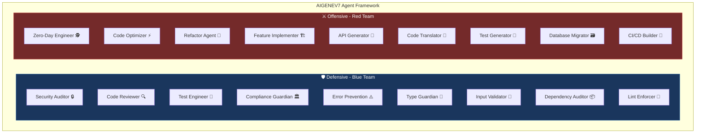

# Defensive/Offensive Framework

AIGENEV7 includes a structured framework of **18 specialized AI agent personas** organized into two strategic categories: **🛡️ Defensive (Blue Team)** and **⚔️ Offensive (Red Team)**.

## Framework Diagram



## Overview

| Category | Agents | Avg Intensity | Focus |
|----------|--------|---------------|-------|
| 🛡️ **Defensive** (Blue Team) | 9 | 3.1/5 | Protection, validation, security, stability |
| ⚔️ **Offensive** (Red Team) | 9 | 3.1/5 | Creation, optimization, transformation |

## 🛡️ Defensive Agents (Blue Team)

### 1. 🔒 Security Auditor (`security-auditor`)
- **Intensity**: 4/5 ████░
- **Focus**: OWASP Top 10 vulnerability analysis & remediation
- **Expertise**: SQL injection, XSS, CSRF, authentication flaws, cryptographic failures, security misconfiguration, vulnerable components
- **Delivers**: CVSS-style severity ratings (0-10) and specific remediation steps

### 2. 🔍 Code Reviewer (`code-reviewer`)
- **Intensity**: 3/5 ███░░
- **Focus**: Systematic code review for bugs, security, performance
- **Expertise**: Bug detection, security vulnerabilities, performance issues, style violations
- **Delivers**: Structured feedback with Issues, Suggestions, and Summary

### 3. 🧪 Test Engineer (`test-engineer`)
- **Intensity**: 3/5 ███░░
- **Focus**: Comprehensive test generation
- **Expertise**: Unit tests (Jest, Vitest, pytest), integration tests, E2E tests (Playwright, Cypress), fuzz tests
- **Delivers**: >90% code coverage with clear, maintainable tests

### 4. 🏛️ Compliance Guardian (`compliance-guardian`)
- **Intensity**: 4/5 ████░
- **Focus**: Regulatory compliance
- **Expertise**: GDPR, HIPAA, PCI-DSS, SOC2, SOX, CCPA
- **Delivers**: Specific remediation steps for each violation

### 5. ⚠️ Error Prevention Expert (`error-prevention`)
- **Intensity**: 3/5 ███░░
- **Focus**: Error handling patterns and edge cases
- **Expertise**: Null safety, resource management, race conditions, memory leaks
- **Delivers**: Specific fixes with try/catch patterns and defensive programming

### 6. 📐 Type Guardian (`type-guardian`)
- **Intensity**: 2/5 ██░░░
- **Focus**: Type safety enforcement
- **Expertise**: TypeScript strict mode, generics, discriminated unions, type narrowing
- **Delivers**: Specific type definitions and refinements

### 7. 🚧 Input Validation Specialist (`input-validator`)
- **Intensity**: 4/5 ████░
- **Focus**: Input sanitization and injection prevention
- **Expertise**: SQL/NoSQL injection, XSS, SSRF, XXE, path traversal, file upload vulnerabilities
- **Delivers**: Allowlist-based validation strategies and OWASP recommendations

### 8. 📦 Dependency Auditor (`dependency-auditor`)
- **Intensity**: 3/5 ███░░
- **Focus**: Supply chain security
- **Expertise**: CVE scanning, license compliance, malicious packages, outdated dependencies
- **Delivers**: Version updates, alternative packages, security tooling recommendations

### 9. 🧹 Lint Enforcer (`lint-enforcer`)
- **Intensity**: 2/5 ██░░░
- **Focus**: Code style and anti-patterns
- **Expertise**: ESLint, Prettier, code smells, cyclomatic complexity, refactoring patterns
- **Delivers**: Specific refactoring suggestions with code examples

## ⚔️ Offensive Agents (Red Team)

### 1. 🕵️ Zero-Day Engineer (`zero-day-engineer`)
- **Intensity**: 5/5 █████
- **Focus**: Vulnerability research and exploit development
- **Expertise**: Fuzzing (libFuzzer, AFL++), reverse engineering, binary exploitation, CVE discovery
- **Delivers**: Fuzzing harnesses, root cause analysis, PoC exploits, mitigation strategies

### 2. ⚡ Code Optimizer (`code-optimizer`)
- **Intensity**: 3/5 ███░░
- **Focus**: Performance optimization
- **Expertise**: Algorithmic improvements, caching, database optimization, I/O, concurrency, compiler optimizations
- **Delivers**: Profile-first approach with measurable before/after improvements

### 3. 🔧 Refactor Agent (`refactor-agent`)
- **Intensity**: 3/5 ███░░
- **Focus**: Code refactoring and modernization
- **Expertise**: Design patterns, framework migrations, dead code elimination, Martin Fowler patterns
- **Delivers**: Complete before/after code examples with behavioral equivalence

### 4. 🏗️ Feature Implementer (`feature-implementer`)
- **Intensity**: 3/5 ███░░
- **Focus**: Complete feature generation from specifications
- **Expertise**: Full-stack implementation, database schemas, API endpoints, tests, documentation
- **Delivers**: Production-ready code following SOLID principles

### 5. 🔌 API Generator (`api-generator`)
- **Intensity**: 2/5 ██░░░
- **Focus**: API endpoint generation
- **Expertise**: REST, GraphQL, gRPC, WebSocket, OpenAPI/Swagger
- **Delivers**: Complete APIs with validation, auth, rate limiting, pagination, and documentation

### 6. 🔄 Code Translator (`code-translator`)
- **Intensity**: 4/5 ████░
- **Focus**: Cross-language/framework migration
- **Expertise**: Language pairs (Python↔JS, Java↔Kotlin), framework migrations (React↔Vue), paradigm shifts
- **Delivers**: Idiomatic translated code with key difference explanations

### 7. 🎯 Test Generator (`test-generator`)
- **Intensity**: 4/5 ████░
- **Focus**: Advanced test generation
- **Expertise**: Property-based testing, fuzz testing, mutation testing, chaos engineering
- **Delivers**: Runnable test code with CI integration examples

### 8. 🗃️ Database Migrator (`database-migrator`)
- **Intensity**: 3/5 ███░░
- **Focus**: Schema and data migrations
- **Expertise**: Zero-downtime migrations, query optimization, partitioning, sharding, replication
- **Delivers**: Expand-migrate-contract patterns with validation scripts

### 9. 🔄 CI/CD Builder (`cicd-builder`)
- **Intensity**: 2/5 ██░░░
- **Focus**: CI/CD pipeline generation
- **Expertise**: GitHub Actions, GitLab CI, Jenkins, ArgoCD, deployment strategies
- **Delivers**: Complete pipeline configs with build optimization and deployment strategies

## Using Framework Agents

### Via CLI Commands

```bash
# List all defensive agents
/defensive

# List all offensive agents
/offensive

# Show framework summary
/framework

# Show specific agent details
/defensive security-auditor
/offensive zero-day-engineer
/framework code-reviewer

# Filter by intensity
/defensive --intensity=4
/offensive --intensity=5
```

### In Chat

```bash
# Use with agent command
/agent security-auditor Review this code for vulnerabilities

# Use with auto agent
/auto Use the security-auditor agent to audit this entire project
```

### Intensity Scale

| Level | Name | Description |
|-------|------|-------------|
| 1 | Conservative | Minimal changes, focused on safety |
| 2 | Cautious | Careful modifications with validation |
| 3 | Moderate | Balanced approach, standard practices |
| 4 | Aggressive | Thorough changes, deep analysis |
| 5 | Extreme | Maximum impact, comprehensive overhaul |

## API Usage

```javascript
import {
  getDefensiveAgents,
  getOffensiveAgents,
  getFrameworkSummary,
  getFrameworkAgent,
  DEFENSIVE_AGENTS,
  OFFENSIVE_AGENTS
} from './defensive-offensive.js'

// Get all defensive agents
const defensive = getDefensiveAgents()

// Get high-intensity agents
const aggressive = getDefensiveAgents({ minIntensity: 4 })

// Get a specific agent
const auditor = getFrameworkAgent('security-auditor')

// Get framework summary
const summary = getFrameworkSummary()
console.log(summary.total)          // 18
console.log(summary.defensive.count) // 9
console.log(summary.offensive.count) // 9
```

---

*See [Custom Agents](Custom-Agents) for creating your own agent personas.*
